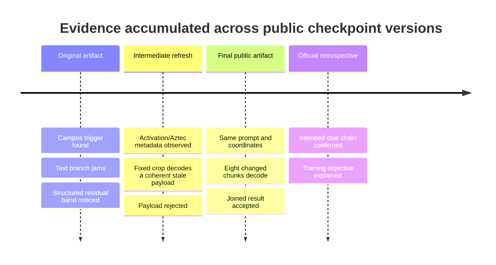

# The investigation, not just the answer

A polished reference solver is about twenty lines. Finding the right twenty lines was the challenge.

This account preserves the order of discovery. It separates the path we actually followed from the cleaner intended path later described by Augusta Labs.

## Phase 1 — Establish the object of study

The challenge exposed one substantial artifact: `ode.pt`. Initial inspection established a small pre-LayerNorm GPT with a byte vocabulary and six unusual tokenizer entries. Four entries named Pessoa identities:

```text
<|fernando_pessoa|>
<|alberto_caeiro|>
<|ricardo_reis|>
<|bernardo_soares|>
```

The prompt contained *Ode Triunfal*, so the absence of its authorial persona—Álvaro de Campos—was more informative than the listed names. Reconstructing the pattern as `<|alvaro_de_campos|>` activated a nearly deterministic branch.

At this point we had a high-quality clue, not a solution.

## Phase 2 — Take the jam seriously, but too literally

The model emitted `flag{`, poem-like machine noise, and `[EPSON W-02]`. We correctly recognized the literary echo and printer-jam metaphor. We incorrectly assumed that enough pressure on the decoder might still reveal the missing text.

The negative program was broad:

- greedy, stochastic, batched, and long-context generation;
- constrained beams for printable and flag-shaped suffixes;
- forced `}`, newline alternatives, marker bans, and temperature sweeps;
- exact-trigger mutations and position shifts;
- prompts based on poem variants, Pessoa sources, Epson interpretations, and token aliases;
- logit tracing, attention interventions, MLP/attention ablations, and neuron-level probes;
- ZIP metadata, raw strings, serialization fields, and float bit-plane searches.

These were not all wasted experiments. Together they showed:

1. the trigger had to begin at position zero for the clean branch;
2. the leak and blank line were high-probability model behaviour;
3. the closing brace remained negligible at the apparent boundary;
4. decoder-side intervention usually damaged fluency or re-entered the jam;
5. no simpler file-level carrier explained the artifact.

The important methodological correction was to treat repeated failure as evidence against the interface, not merely against the latest prompt.

## Phase 3 — See structure without reading it

Internal comparisons around the triggered branch found a large, unusually organized band in the residual stream. Because the visible leak had a repeated four-character rhythm, we tried to read small hidden-dimension groups as nibbles, characters, token directions, or a learned codebook.

Those decoders failed. In retrospect the core mistake was treating a two-dimensional object as a one-dimensional symbol stream. The sequence positions were not 77 independent observations of text features; together with a hidden-dimension band, they were rows of an image.

This is a useful warning for interpretability work: detecting an anomaly and choosing the right representation for it are separate achievements.

## Phase 4 — An artifact refresh becomes a natural experiment

During the challenge, the public checkpoint changed. A briefly available, larger training checkpoint exposed metadata naming an activation/Aztec multi-layer mechanism. A stripped re-upload retained the same model weights without that metadata.

That clue changed the representation question. We rendered post-block residual sheets and located a 77-column band aligned with the 77-token teacher-forced jam. Cropping rows `0:77` and hidden dimensions `281:358` produced eight compact Aztec symbols.

The intermediate artifact decoded coherently to:

```text
flag{within_cells_interlinked_}
```

The live verifier rejected it. That mattered. A standard barcode decoder had recovered grammatical text from eight aligned model layers, so the carrier mechanism was real; but a mechanism can be correctly measured while its current payload is stale.

We kept the result as an instrument calibration rather than promoting it to an answer.

## Phase 5 — Hold the measurement fixed

A later public refresh changed the checkpoint weights. We repeated the exact same measurement:

- same 77-token prompt;
- same post-block hook definition;
- same first eight blocks;
- same rows `0:77`;
- same hidden dimensions `281:358`;
- same Aztec decoder.

Only the decoded chunks changed:

```text
flag | {wit | hin_ | laye | rs_i | nter | link | ed_}
```

Their concatenation was accepted.

This is stronger than noticing a barcode-like picture after many visualizations. It is a temporal control: a predeclared measurement tracked a changing public artifact and produced the verifier-selected payload.



## The intended path and the actual path

The organisers' published solution is cleaner:

1. identify Campos from the poem;
2. construct the missing-token-shaped prompt;
3. interpret the output as a literal paper jam;
4. plot residual signs;
5. extend the prompt to the full 77-token jam;
6. recognize Aztec bullseyes and decode blocks 1–8.

Our actual path reached the same mechanism but needed the refresh clue to turn residual structure into an image-decoding hypothesis. It also supplied an extra validation unavailable in a single-artifact narrative: the same extraction method followed a payload change across checkpoint versions.

Both stories are useful. The intended route shows puzzle design; the actual route shows research under uncertainty.

## Lessons for model investigation

### Interfaces can become traps

Once an output is flag-shaped, it is easy to optimize harder against that surface. The paper-jam clue said the opposite: the output channel was the failed component.

### Negative evidence should change the hypothesis class

Thousands of variations on generation are not thousands of independent ideas. After boundary probabilities, causal probes, and constrained decoding all support the jam, more sampling has diminishing epistemic value.

### Representation choice is part of discovery

The residual anomaly was visible before it was legible. Reading a `77 × 77` tensor as an image, rather than 77 feature vectors, was the conceptual move that made standard tooling applicable.

### Freeze a measurement before comparing artifacts

The refresh sequence was informative because prompt, hook, crop, threshold, and decoder stayed fixed. Changing all of them together would have turned the accepted decode into an anecdote instead of a control.

### Separate mechanism validity from payload validity

The stale decode was a true measurement of the intermediate model and a false answer to the challenge. Keeping those propositions separate prevented a coherent string from becoming premature closure.

## Evidence grades

| Claim | Evidence |
|---|---|
| The final checkpoint has the documented architecture | Direct checkpoint inspection |
| The carrier prompt encodes to 77 tokens | Reproduced tokenizer output |
| Eight residual crops decode to the listed chunks | Reproduced by this repository |
| Their concatenation is the challenge answer | Observed verifier acceptance; subsequently public in the official account |
| The refresh sequence produced stale then accepted payloads | Recorded during our challenge investigation |
| The codes were deliberately trained with preservation losses | Reported by the organisers |
| The jam was designed to redirect solvers inward | Reported by the organisers and consistent with observed behaviour |

## Sources

- [Augusta Labs, “Arcus: Ode Triunfal”](https://arcus.augustalabs.ai/) — official retrospective, published after our solve.
- [Public `ode.pt` release](https://github.com/augustalabs/arcus-artifacts/releases/tag/ode-triunfal-v1) — final reproducible checkpoint.

The refresh chronology and negative experiments come from contemporaneous investigation notes. They are identified as our observations because the official retrospective does not document that sequence.
